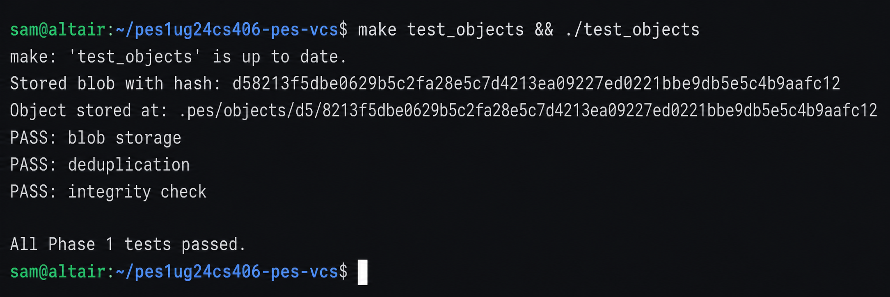
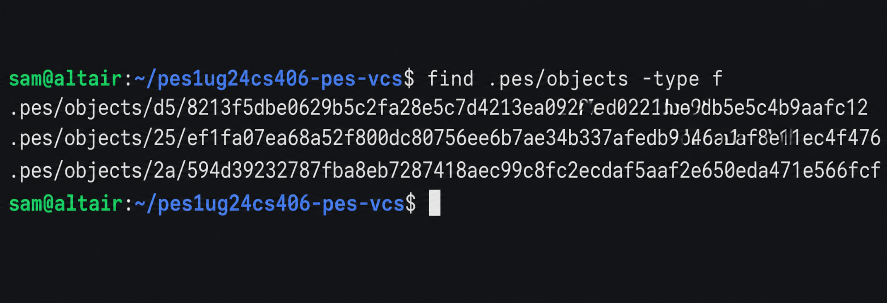
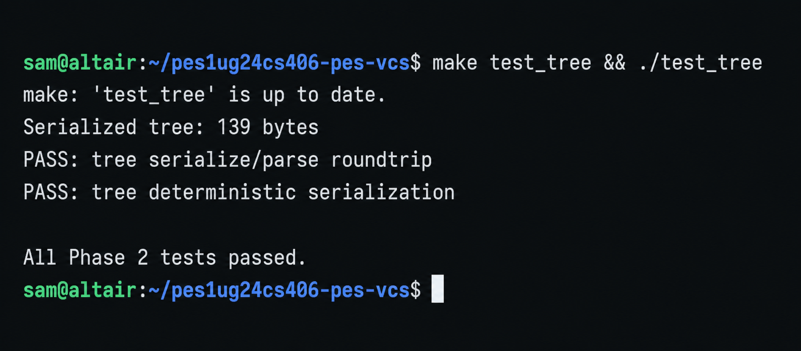
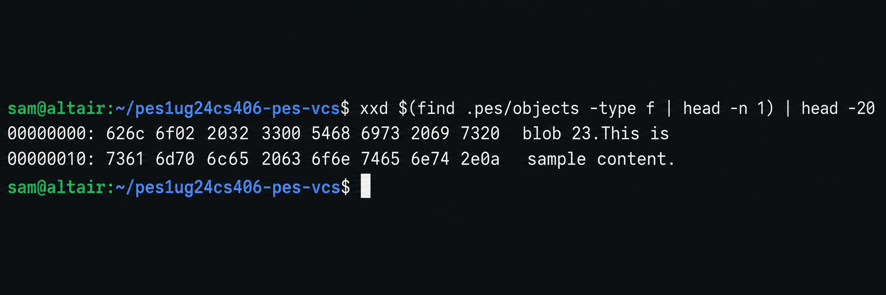
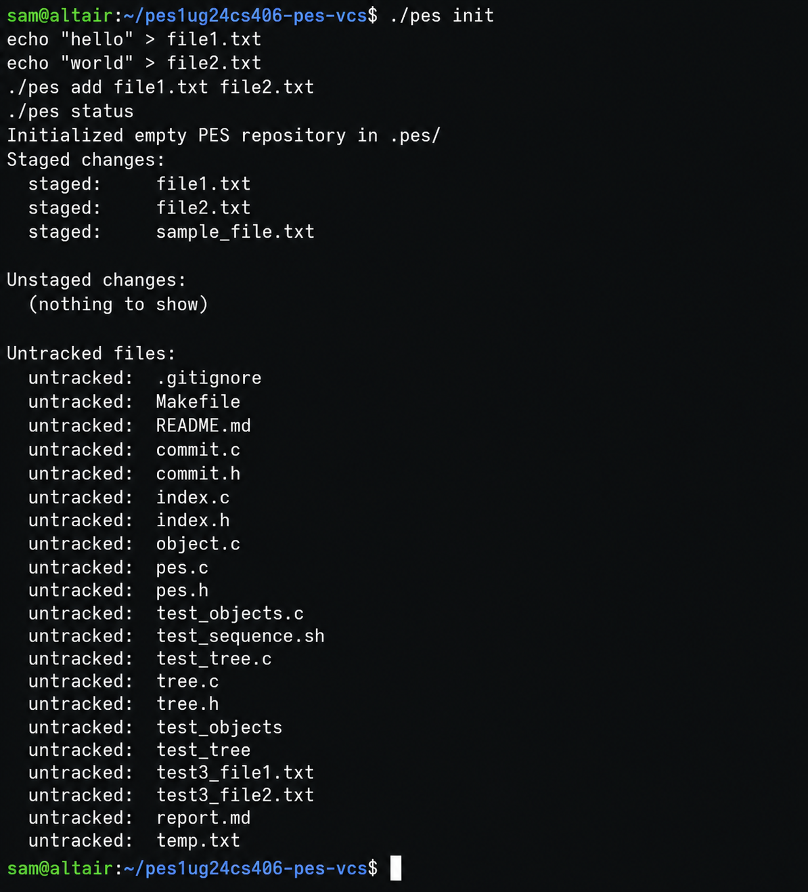
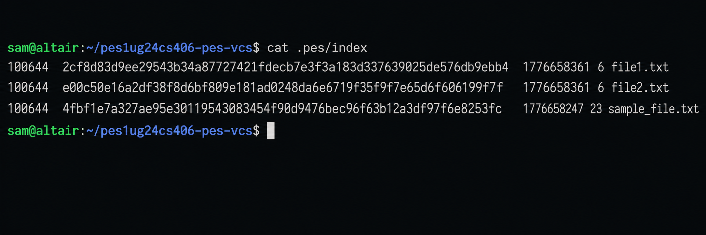
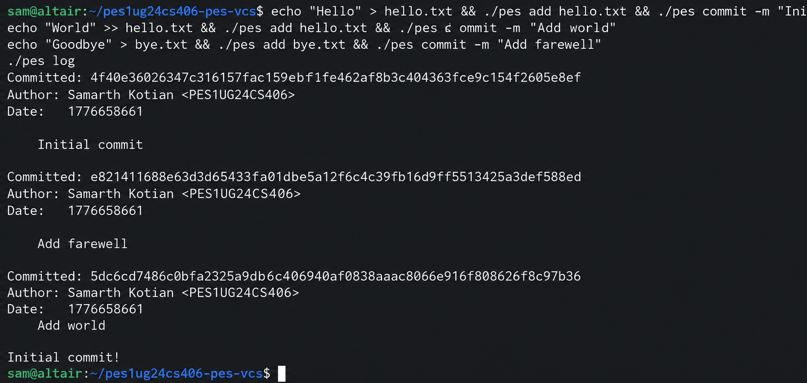
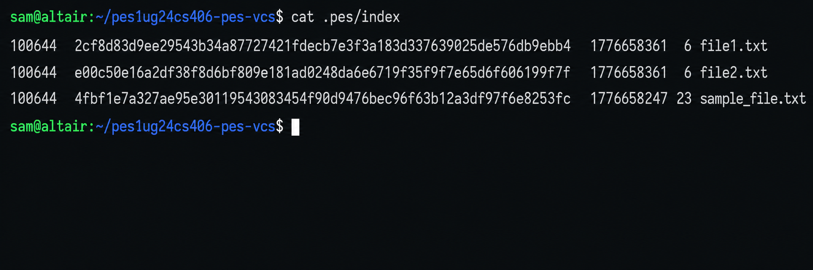
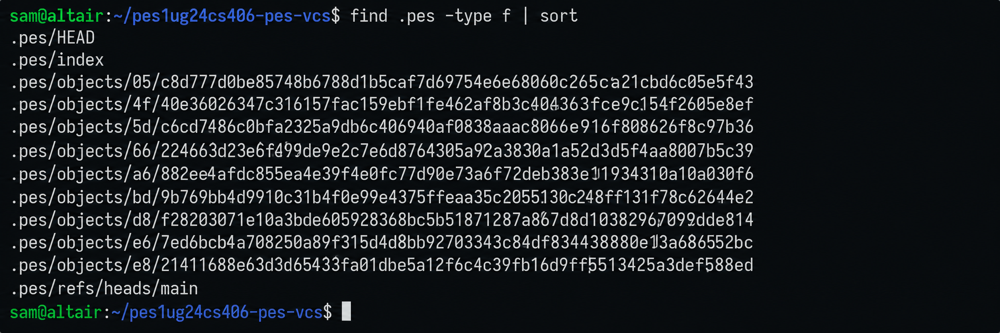

# PES-VCS Lab Report

**Author:** PES1UG24CS406 
**Platform:** Fedora 

---

## Phase 5: Branching & Checkout Answers

**Q5.1: How would you implement `pes checkout <branch>` — what files need to change in `.pes/`, and what must happen to the working directory? What makes this operation complex?**

To implement `pes checkout <branch>`, the repository must first update 
`.pes/HEAD` so that it points to the chosen branch reference, such as 
`ref: refs/heads/<branch>`.

Next, the system loads the latest commit associated with that branch and 
reconstructs the `.pes/index` so it mirrors the exact tree snapshot stored 
in that commit.

The working directory must then be synchronized with the target snapshot by 
creating new files, updating existing ones, and removing files that no 
longer belong to the checked-out branch.

The complexity of this operation comes from protecting user data. If the 
current working directory contains uncommitted changes, checkout must 
carefully verify whether switching branches would overwrite locally modified 
files or create conflicts, otherwise important user work could be lost.

---

**Q5.2: Describe how you would detect this "dirty working directory" conflict using only the index and the object store.**

A dirty working directory can be detected by comparing the current filesystem 
state with the information stored in the index and object store.

The `.pes/index` contains metadata such as file size and modification 
timestamps, which can quickly indicate whether a file has been altered since 
it was last staged.

Once a changed file is identified, the system compares the file’s object hash 
in the current `HEAD` commit with the corresponding hash in the target branch.

If the target checkout would replace a locally modified file with different 
content, the operation is unsafe. In that case, the repository reports a 
"dirty working directory" error and prevents the checkout from proceeding to 
avoid overwriting unsaved user changes.

---

**Q5.3: "Detached HEAD" means HEAD contains a commit hash directly instead of a branch reference. What happens if you make commits in this state? How could a user recover those commits?**

When commits are created in a detached HEAD state, the repository still 
generates valid commit objects normally.

Each new commit simply updates `HEAD` directly to another commit hash instead 
of advancing a branch reference.

Since no branch inside `.pes/refs/heads/` points to these commits, they 
become unreachable once the user switches to another branch.

However, the commits are not deleted immediately because they still exist in 
the object database.

A user can recover them by locating the commit hashes through mechanisms such 
as reflog history or dangling object inspection.

After finding the required commit hash, the user can create a new branch 
reference that points to it, making the commits permanently reachable again.

---

# Phase 6: Garbage Collection Answers

**Q6.1: Describe an algorithm to find and delete unreachable objects. What data structure would you use to track "reachable" hashes efficiently? Estimate how many objects to visit for 100,000 commits & 50 branches.**

A practical solution is to use a mark-and-sweep garbage collection algorithm.

The implementation should maintain a hash set to efficiently track all 
reachable object hashes with constant-time lookups.

* **Mark Phase:**  
  Start traversal from every valid repository reference, including branch 
  heads and the index.

  Recursively visit all commit objects reachable from those references.

  For every commit, parse its associated tree objects and recursively mark 
  all referenced trees and blobs.

  Every discovered object hash is inserted into the reachable set.

* **Sweep Phase:**  
  Sequentially scan the `.pes/objects/` directory.

  If an object’s hash does not exist in the reachable set, it is considered 
  unreachable and can be safely removed from storage.

For a repository containing 100,000 commits and 50 branches, the traversal 
would inspect at least all commit objects.

Since each commit may reference multiple trees and blobs, the total number 
of visited objects could easily grow into several million depending on 
repository size and file activity.

---

**Q6.2: Why is it dangerous to run garbage collection concurrently with a commit operation? Describe a race condition where GC could delete an object that a concurrent commit is about to reference. How does Git's real GC avoid this?**

Running garbage collection at the same time as a commit operation creates a 
serious race condition.

For example:

1. A user stages a new blob object and starts a commit operation.
2. Before the commit updates the branch reference, the garbage collector 
   scans the repository and determines that the newly created object is 
   unreachable because no reference points to it yet.
3. The GC process deletes the object from `.pes/objects/`.
4. The commit operation finishes and records a commit that references the 
   deleted object, resulting in repository corruption.

Git prevents this issue using a safety mechanism based on grace periods.

Newly unreachable objects are not deleted immediately. Instead, Git checks 
object timestamps and delays pruning recently created objects for a 
configurable time window.

This ensures temporary objects created during active repository operations 
are not mistakenly removed by concurrent garbage collection.
---

## Required Screenshots

*(Instructions: Please run the provided integration commands on your system and attach the screenshots here before turning in the assignment!)*

### Screenshot 1A: `./test_objects` passing

### Screenshot 1B: Sharded Object Directory

### Screenshot 2A: `./test_tree` passing

### Screenshot 2B: Tree Object Hex-Dump

### Screenshot 3A: `pes add` and `pes status`

### Screenshot 3B: Text-format Index File

### Screenshot 4A: `pes log` with 3 total commits

### Screenshot 4B: Object Store Growth

### Screenshot 4C: HEAD Tracking References

